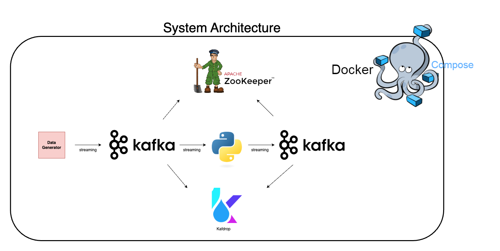

# Fetch Take Home

## Overview
- Architecture
- Code Components
- How to run the code
- Design Decisions
- Take Home Answers

## Architecture



The project is a streaming pipeline that receives data from a kafka topic, processes the data and sends it to other kafka topics.
We use Docker compose to orchestrate and manage the different containers.

- **Kafka** : Message Broker used to stream data from producer to consumers
- **Data Generator** : Sends data to a kafka topic
- **Zookeeper** : Coordination service used in tandem with Kafka to form a complete kafka cluster
- **Python** : Processes the data and sends it back to a Kafka topic
- **Kafdrop** : Simple UI to oversee kafka cluster.

## Code Components

Here is the main folder structure of the code in the repo :

- **tests** : contains tests
- **user_login** : contains functions used in the main script as well as the schema for the messages
- - schemas : folder that contains schema in a json file
- - consume.py : contains functions
- **docker-compose.yml** : Manages the containers
- **dockerfile** : Creates an image for the main app
- **main.py** : main script that runs the pipeline
- **requirements_dev.txt** : dependencies for development work (ex: adding code locally, running tests,etc.)
- **requirements.txt** : dependencies of the main app


## How to run the code

### Prerequisites

Make sure you have the following installed :
- python
- git
- pip
- docker

### Run tests locally

**0. Install dependencies for dev work**
```sh
pip install -r requirements.txt
pip install -r requirements_dev.txt
```
**1. Clone the repository**
```sh
git clone https://github.com/seydou123/fetch_rewards.git
```
**2. Navigate to the root**
```sh
cd fetch_rewards
```
**3. Run pytest**
```sh
pytest
```
### Run the pipeline
**1. Clone the repository**
```sh
git clone https://github.com/seydou123/fetch_rewards.git
```
**2. Navigate to the root**
```sh
cd fetch_rewards
```
**3. Run docker compose**
```sh
docker-compose up -d
```
This will start all the services. Once everything is up and running you can attach to the logs of the main app with the below command :
```sh
docker logs -t -f main-app
```
To access the simple Kafka UI (Kafdrop) go to a web browser and type this :
```sh
http://localhost:9000/
```

## Design Decisions

### Data Processing

For data transformations, I decided to rename the field timestamp to *created_at*. The reasoning is to make sure we can understand exactly what the field represents as
there are often many timestamps involved. For example, the *processed_at* timestamp which I added is a different time field but also useful to have. Both timestamp are in UTC timezone. I could have named them *created_at_utc* and *processed_at_utc* to be more precise, especially since in some cases we algo get the local timestamp and/or UTC offset.

As my data transformations were simple and the throughput was not too big, I kept it simple and used pure python to do the data processing. In the next section, I'll mention how I could have used a distributed streaming processing framework like Flink if we performed this in a produciton environment and/or if this scaled.

During the format_data() function, if the message does not conform to the expected schema, the original message is then sent to an error topic acting as a dead letter
queue. It does not stop the pipeline. In the next section I'll touch on how in a production environment we would want an actionable setup or process to ensure we deal with those
messages that don't respect schema.

For schema validation, I used JSON schema with json files. Simple to use and appropriate in the context of a take home. I think it's an okay way to enforce schema comapred to nothing or plain python. For a production pipeline, the use of Schema Registry on top of it could be interesting.


### Kafdrop

I decided to use Kafdrop for UI monitoring as it's a simple and lightweight tool for basic monitoring of Kafka clusters.
In the context of a take home exercise or for quick development, it's a useful tool that is easy to setup. This would probably not be my choice for a production pipeline(more on that on the next section) as it is quite limited.


## TakeHome Answers

### How would you deploy this application in production?
**Non local automatic deployment**

In production settings, this would not be deployed locally. We would have CICD that can deploy the pipeline and the infra using IaC. We would probably also use K8s to help with scaling, availability, access controls, resources fine tuning and management.

**Monitoring and alerting**

In production, we want good monitoring and logging. This can help a lot in knowing what is going on and it's also useful for troubleshoting(ex: errors, consumer lag,etc.). Here, we could use something like
Datadog($$) or go with the open source combo of Grafana+Prometheus. The goal here is to have a complete monitoring solution where we can access important metrics about our application, have some centralized logging and setup alerting. Depending on team size and skills, time and budget we could go for one or the other.

**More E2E tests**

Adding more end to end testing and integration tests instead of just unit tests.

### What other components would you want to add to make this production ready?
**Kafka setup**

Making sure our replication is sufficient to ensure fault tolerance. Considering what should the retention period be and our clean up process.
**Proper DLQ processes**

While we have a topic acting as a dea letter queue, we still lack a proper process for how we want to handle those messages. This would
be essential in a production environment.


**Schema Registry**

We used JSON schema in the take home, but in a production environment we could use Schema Registry for robust schema validation and avoid schema evoltion issues.

### How can this application scale with a growing dataset?

**Stream processing tool**

With a growing data size and for stateful operations , we could use a proper streaming processor like Flink, Kafka Streams or Spark streaming


**Scaling Kafka**

To scale with data, we should consider proper partitioning for topics and scaling producer/consumer instances to keep up.
